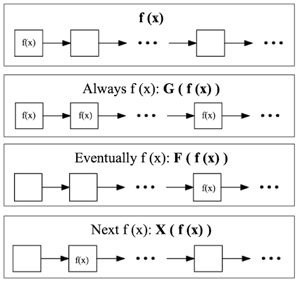
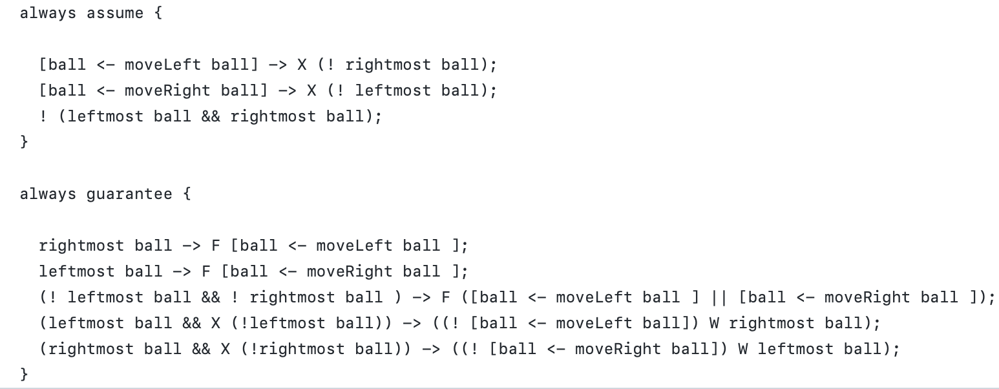
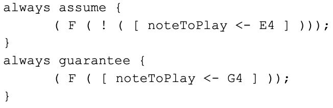
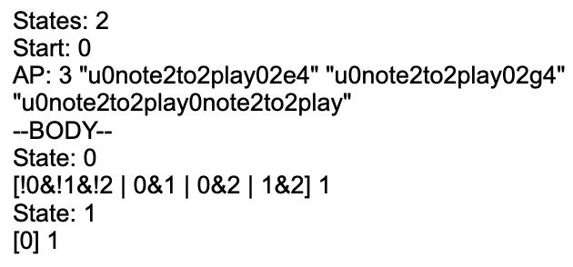
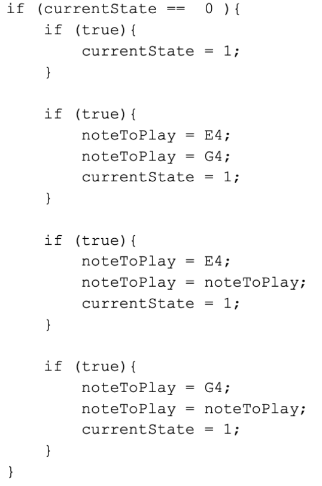
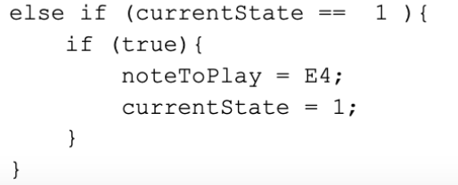
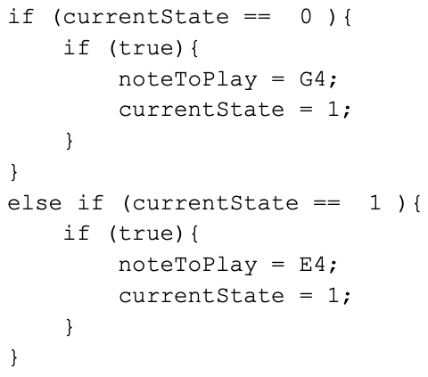

# SRI 2022 Research Documentation and Progress

### Authors: Leyi (Angel) Cui (BC'24), Raven Rothkopf (BC'24)

## Initial Research

Over the past ten weeks, we have been exploring how to make writing TSL more straightforward for programmers of all skill levels. Our first goal was to design a structured editor that eliminated the need to know the intricacies of TSL’s syntax and operators. We developed the **structured editor**, [dynamicGrammars](https://barnard-pl-labs.github.io/dynamicGrammars/), with dropdown menus that displayed the TSL grammar.

With [this original interface](https://barnard-pl-labs.github.io/dynamicGrammars/frontEnd/oldDG.html), users could learn TSL through the context of music. We then presented the idea of an autofill system that could help users learn to write TSL and use its grammar, not just build it from dropdowns. More musical richness were then added to [the interface](https://barnard-pl-labs.github.io/dynamicGrammars/frontEnd/dynamicGrammars.html). After finishing our initial iterations we realized that TSL’s syntax and operators are only inhibitors for first-time users and become straightforward after playing around with dynamicGrammars or the [tsltools web API](https://barnard-pl-labs.github.io/tsl-api/). **We realized that:**
> **The real problem with TSL isn’t its syntactic complexity, it’s that there is no uniform approach to designing a logical system with it and no debugging tools to help standardize that approach.**

## Pilot Studies

We talked to three of our peers in the lab who were writing TSL in varying fields to help us identify the main difficulties in TSL design.

**The first user** (Admire) was working on translating existing Python code for CARLA, an autonomous vehicle simulator, into TSL specifications. The general problem he experienced was that the first version of the TSL spec he wrote didn’t cover all logical scenarios. The main difficulties are as follows: 

1. Coders aren’t used to thinking in the general case first. They normally focus on defining edge cases (if-else statements). In TSL, they have to write the general assumptions of the environment *and* its edge cases.
2. In Python, conditions like the levels of priority in if-else statements are implicit. In TSL, everything must be explicitly defined. 
3. It’s difficult to visualize how a TSL system and its operators (F(), X(), G(), U()) change over time. 

4. Negating logic is hard ( F(!) vs. ! (F) ). 

**The second user** (Hannah) was designing a game with TSL. The major problem we identified was that when game designers write code, they want to make it human-readable. Thus, the state machine they come up with might include more states than necessary. However, with TSL, **the most human-readable design isn’t always the most efficient one.** The user designed a system with three states, but the TSL spec only generated one. Determining how many states are wanted vs. how many are actually needed makes writing TSL less intuitive for game designers. Also, each time she added an assumption or guarantee, it was hard to figure out what to add and where to add it and equally as hard to debug if the generated code didn’t mirror the system she intended to design. 

**The third user** (Arya) was animating a cube in three.js using TSL. The main problem this user was experiencing wasn’t writing the TSL spec, but figuring out how to refactor her code so that she could seamlessly integrate the TSL spec into it. **Knowing what functions to add and how to add them can be difficult for programmers of all skill levels.** 

This user’s struggle with refactoring speaks to a broader issue with TSL. What makes the specification language so useful is that it separates “control” from “data”. In theory, this allows programmers to focus on the functionality of their programs and how they change over time, not variables and data management, but this isn’t entirely true. While users have to write considerably less code, they still have to think about the interactions between their TSL-generated state machine and the context that the state machine is operating. They also need to write the functions that the spec will manipulate and be familiar with some programming language. **Separating control from data forces programmers to split the process of developing a program between two languages. These languages are not only different but often require conflicting modes of thinking and problem-solving.** Ideally, we want to get to a space where code refactoring is standardized so that users don’t have to start from scratch whenever they want to integrate TSL into a system.  

In general, these cases show that users need to know TSL in the context of the logical system they are trying to design, not just TSL. Another common thread is that all three users **rely on programming as a crutch:**    
They start by coding in python/javascript and then refactor their model into TSL. There is a fundamental disconnect between how programmers are taught to think and how they have to think when writing temporal logic. How do we reconcile that disconnect? 

Users are also experiencing unique problems due to their educational backgrounds. For those who understand state machines, it might be helpful to construct TSL specs by drawing out the states, while for others state machines complicate the process. How do we cater to different programmers with different backgrounds/needs when writing TSL? 

All three users noted that TSL is hard to debug because of the lack of error messages from the API and the overly complicated code generated by the specs. When synthesizing TSL, the tsltools API will respond with “Internal Server Error” when there’s an issue with the specification, whether it's logical or syntactic. When the spec is satisfiable, the API will respond with overly complicated code with repeating lines and too many if statements. This output is not an encouraging space for debugging or iteration because users first have to pick through the code to understand it and then identify where/what the problem is. **TSL needs a human-readable medium to help users debug.** After reflecting on the findings from our user studies, we decided that addressing this issue was the next step to improving TSL’s usability. 

##tsltools Documentation and Process

Improving the readability of the TSL-generated code first requires an understanding of the inner workings of our synthesis tool, [tsltools](https://barnard-pl-labs.github.io/tsltools/). Currently, there are no tools that can directly synthesize TSL, but they exist for synthesizing Linear Temporal Logic (LTL), TSL’s relation. To synthesize TSL, we need to underapproximate it as LTL. The difference between the two specification languages is that LTL only has boolean terms, and TSL implements both update and predicate terms. 

For TSL to be compatible with LTL, its update and predicate terms need to become boolean terms. For example, an update term in TSL, “[x ← y]” needs to become the boolean variable “y_to_x”. A predicate term in TSL, “f x” needs to become the boolean variable “f_x”. tsltools takes a spec written in TSL and by executing the program tsl2tlsf it underapproximates the spec as LTL (a .tlsf file). tsltools then takes advantage of an LTL synthesis tool, [spot](https://spot.lrde.epita.fr). Spot takes the refactored TSL and outputs a file in [Hanoi Omega-Automata (HOA)](http://adl.github.io/hoaf/) format. The synthesis tool then uses the .hoa file to generate the code seen on the client side. In summary, the tsltools process is as follows:

**.tsl spec** → [tsl2tlsf → **.tlsf spec (LTL)** → ltlsynt → **.hoa file** → hoa2code] → **python/js/xstate code**

**If we want to simplify the generated code, we need to do it after the .hoa file is generated and before it’s turned into code.**

The following example shows a TSL spec and its corresponding annotated .hoa file:
<table>
<tr>
<th>TSL Specification</th>
<th>HOA File</th>
</tr>
<tr>
<td>
<pre>
  1 always assume {
  2 
  3 }
  4 
  5 always guarantee {
  6    isEven x → [x ← y];
  7 }
</pre>
</td>
<td>

<pre>
HOA: v1
States: 1 //number of states
Start: 0 //start state 
AP: 3 "u0x0x" "u0x0y" "p0p0is2even0x" 
/* atomic propositions 0 through 2:
“u0x0x” → update x with x
“u0x0y” → update x with y
“p0p0is2even0x” → predicate, isEven(x) */

/* irrelevant
acc-name: all
Acceptance: 0 t
properties: trans-labels explicit-labels state-acc deterministic */
--BODY-- //state machine
State: 0
[!0&1&!2 | 0&!1&!2] 0 //transition
[!0&1&2] 0
--END--
</pre>

</td>
</tr>
</table>

Each set of atomic propositions in a transition translates to an if statement in code. The predicates are the conditions of the if statement. The updates are the changes made to each variable depending on the condition. As you may notice, even this small file has areas that could be simplified. In the next section, we identify two main classes of optimizations we could perform. 

## Discussion on generated code optimization and synthesis tool behavior

### The 1st class of optimization: deleting invalid transitions

An invalid transition is defined as a transition that violates an assumption specified in TSL or TLSF.

#### *Example: Bouncing Ball*

##### TSL

	
##### HOA

##### Code

In the mealy machine, state 0 is responsible for moving the ball to the left if it's not in the leftmost position and moving it to the right if it is in the leftmost position. There will never be a time when the ball is in the leftmost and rightmost position, as specified in TSL, and yet the first line in the HOA format describes a set of transitions that violate the spec. State 1 is responsible for moving the ball to the left, so there will never be a time when it’s in the rightmost position, and state 2 is the same scenario but in opposite directions. Spot generates invalid transitions for these cases as well. This behavior creates **large chunks of code that will never be executed and are confusing to those trying to understand and debug their code** generated from TSL specs, especially in more complicated systems with many states and assumptions. For example, one researcher was writing TSL specs for CARLA, an autonomous vehicle simulator, and his spec generated 44 states and thousands of lines of code. He couldn’t understand the code and how/why it was generated. This example speaks to a broader difficulty with synthesis. Sometimes the system can be unpredictable, but the programmer must at least semi-understand the synthesized code to deal with that unpredictability. 

This behavior can be attributed to the idea that **false implies true**. Our assumptions say that certain scenarios will never be true. If they are true then the system is free to make all sets of updates because there’s no specification for that violation. Our question is: **how do we want to handle invalid transitions?** It’s clear that spot’s approach is not suitable if we want to generate straightforward and human-readable code. Our other options are to

1. delete all invalid transitions
2. delete all invalid transitions, and create one that returns an error if the assumption is violated

What are the benefits of leaving an optimized invalid transition in the code? Would it help users to understand the nuances of TSL? Or would it just make it more confusing? Can handling invalid transitions in these ways be done through spot, or does it require us to create a postprocessing algorithm on the HOA file? (This question was asked in an email to the spot developers and we are still waiting for a response.)

### The 2nd class of optimization: condensing valid transitions

The example of this part should be updated shortly. Since the update term should not be written in the always assume section.

#### *Example: Music Notes*

##### TSL

##### HOA

##### Code

##### Manually Refactored Output

In this system, at some point in time, G4 will play instead of E4. The spec generates a two-state machine where G4 plays once, and then after that, E4 plays infinitely. In theory, a transition only needs one set of updates per state. **Spot often generates multiple transitions to the same state with multiple and repeating updates**, as seen in the example. State 0 has four transitions to state 1 when it only needs one. When looking through [example specs and their corresponding HOA representations](https://github.com/Barnard-PL-Labs/tsltools/tree/master/src/test/res), we’ve noticed more often than not, **the last set of atomic prepositions in a transition seems to be the only necessary one.** This statement requires further research and examples to prove but could be a possible path to an optimization algorithm. This example also highlights another strange behavior that may have more to do with TSL than the synthesis tool. The function “noteToPlay” is treated as both an input and an output and is updated with itself on multiple occasions when it’s redundant. Understanding this behavior may require reviewing [TSL’s formal documentation and definition](https://www.cs.yale.edu/homes/piskac/papers/2019FinkbeinerETALTSLLogic.pdf) [1]. Although only minorly inconvenient, eliminating this line in the code is another area for optimization.  

## Relevant Work   

### A Perspective on the Evolution of Live Programming, Steven Tanimoto, University of Washington [2]

We explored Tanimoto’s concept of levels of liveness in live programming and how it intertwines with the framework for TSL. In his paper, Tanimoto defines six levels that a live program could be classified. These levels are illustrated below. 

To get TSL to level one, we need to embed a state machine visual representation of the specs into our TSL editor. Ideally, this machine would dynamically cycle between states when the code is running. 

**While TSL can’t be considered a live coding environment under these standards, it already incorporates elements from multiple levels, breaking the hierarchy of liveness.** This is because reactive synthesis transcends the traditional four-phase program process (edit, compile, link, debug) with its fifth and final tactically predictive phase. By nature, one TSL spec has many equivalent representations in code. Before the synthesis tool generates code on the client side, it decides which representation to display to the client. This prediction can be considered an element of the 5th level of liveness.

Interfaces like dynamicGrammars bring TSL into the live coding space, but it’s hard to see how these environments can progress past needing to be executable by the user (level 2). Level 3 requires the environment to update the system any time the user edits their spec. One solution (in the context of dynamicGrammars) is to constantly play music and only change it when the API receives a satisfiable spec, but many satisfiable specs generate unusable code. **The spec must be satisfiable and generate executable code in the context of the system on the other side** (Tone.js, three.js, CARLA, etc.). This dilemma is another potential area for research. Regardless, this hierarchy provides a solid framework for the current and future spaces we are working in with TSL. 

### Exploring Novice Programmer Example Use, Michelle Ichinco, and Caitlin Kelleher, Washington University [3]

Both expert and novice programmers use examples when writing code. More studies have been done on expert programmers’ example use. Findings from previous studies on it include 1) expert programmers only use examples as an initial source of information, and 2) they started to use example code before fully understanding it and made mistakes while adapting the example. In this study, researchers focused on how novice programmers use examples when coding. The participants were kids aged 10-15 with less than 3 hours of programming experience, and they completed coding tasks in pairs. They found that, for novice programmers, using concepts from examples was more challenging than identifying them. Participants spent more time on the task after the “realization point” (the moment the participants understood how to integrate the example into their code) than before. In the paper, the researchers also introduced the hurdles that novice programmers were going through. We summarized each hurdle and how it can be related to our study on TSL.

A **context distraction** hurdle happens before the realization point. It refers to the unfamiliarity with the programming environment and/or code. This hurdle can be linked to the problem we first identified when writing TSL. For beginners, not understanding TSL’s syntax makes it difficult to begin writing it. The researchers mentioned that for participants that are new to the programming environment and the task, getting past this hurdle is valuable. **It’s important to have balance so that users have enough freedom to learn TSL on their own, but enough guidance so that it’s easier to understand and write.** Thus, we also want to think about how much we want our structured editor to interfere with the context distraction hurdle our users are going through.

An **example comprehension** hurdle refers to the confusion about the example that prevented programmers from using it or being able to generate idea based on it. In some cases, the participants did not understand how the example related to their task, so they did not even consider using it. In other cases, they did not understand what was happening in the example. In these cases, they had a much later realization point. This can be linked to the problem of what examples should be chosen for users to learn about TSL. The existing documentation on [‘what is TSL’](https://barnard-pl-labs.github.io/tsltools/tsl_intro_blogpost) is not as helpful for more complicated systems since it only involves changing notes in the context of music.

A **programming environment** hurdle refers to the unfamiliarity or confusion with the programming environment, and it happens after the realization point. In TSL, the programming environment may be the structured editor or the API. For dynamicGrammars, this hurdle might be the abundance of buttons and functions available on the screen. However, dynamicGrammars is a step ahead of the [TSL Synthesis Synthesizer](https://tslsynthesissynthesizer.com) for music in its usability. This also relates to the question we raised when introducing the context distraction hurdle.

A **code misconception** hurdle refers to the misconceptions about how the programs work. In some cases, it is often followed by code comprehension hurdles, in which participants expected their code to do one thing, but it did another. We’ve identified generated code misconception and comprehension as one of the main difficulties with writing TSL. Having misconceptions about TSL (function interactions, behaviors overtime, general TSL rules, etc.) can lead to confusing behavior in generated code. This could be extended to not understanding the generated code due to overly complicated API output. In this case, the code may be correct, but it’s hard to verify that.

In TSL, we are all novice programmers to an extent, so we all experience these hurdles on occasion. They are important to address when furthering our work. In the future, we want to have a **running list of example specs** in a **variety of contexts** available for users to pick through and understand. They could be a mix of examples provided in the tsltools repository and ones we write, mainly focusing on different TSL concepts. In the study, they used **annotated examples**, which were helpful for participants. Additionally, having a **help section** that includes operator definitions and explanations, and a list of the most common problems of writing TSL (negation issues, syntax, multiple simultaneous updates to the same function, etc.) may be helpful.

## References & Additional Helpful Links

[1] Finkbeiner, et al. “Temporal Stream Logic: Synthesis beyond the Bools.” Computer Aided Verification, 2019, pp. 609–629., https://doi.org/10.1007/978-3-030-25540-4_35.    
[2] Tanimoto, Steven. (2013). A perspective on the evolution of live programming. 2013 1st International Workshop on Live Programming, LIVE 2013 - Proceedings. 31-34. 10.1109/LIVE.2013.6617346.    
[3] M. Ichinco and C. Kelleher, "Exploring novice programmer example use," 2015 IEEE Symposium on Visual Languages and Human-Centric Computing (VL/HCC), 2015, pp. 63-71, doi: 10.1109/VLHCC.2015.7357199.

[Program Synthesis: how to](https://docs.google.com/presentation/d/19tw3bVFKbB4Jlz-PJmSb1_uRTLpzpJqw3h8taqY4vfQ/edit#slide=id.g131ff987028_0_33)

[Initial SRI project pres](https://docs.google.com/presentation/d/1WGnCE4jGARl453xb5Ojy5S2RAUJ2CNUiaWcoilt7Kz8/edit?usp=sharing) (justification behind the structured editor)

[XState visualizer](https://stately.ai/viz)
